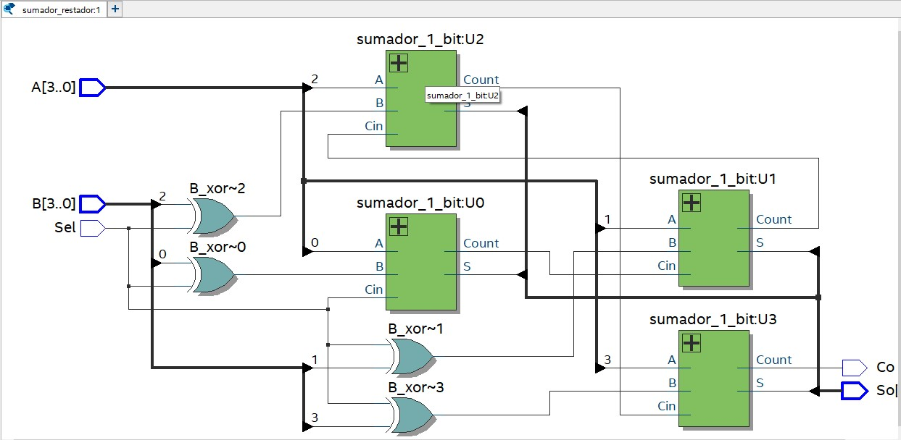
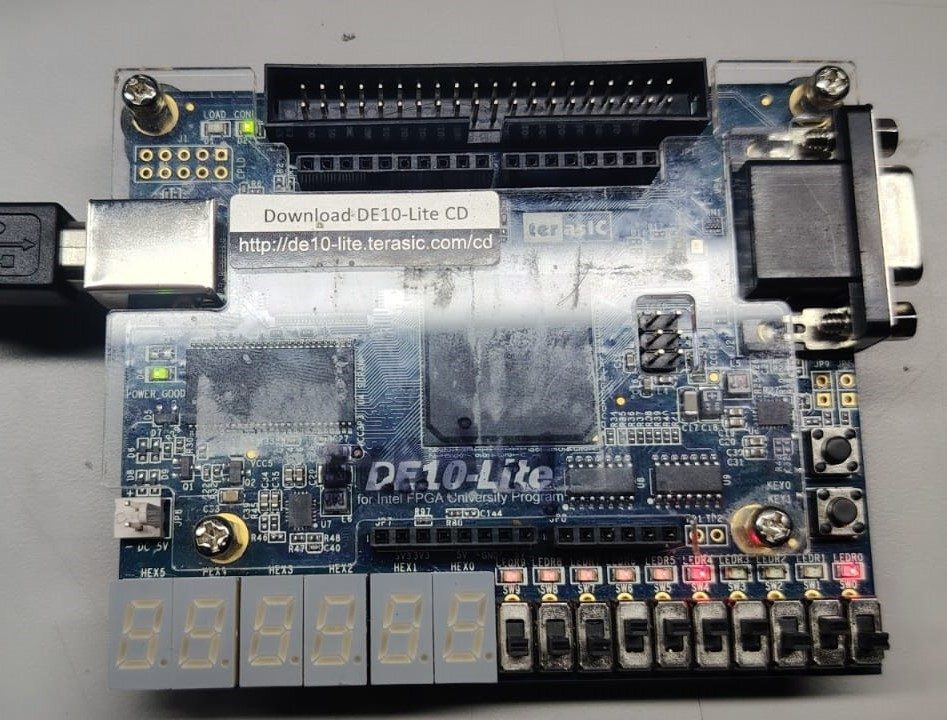
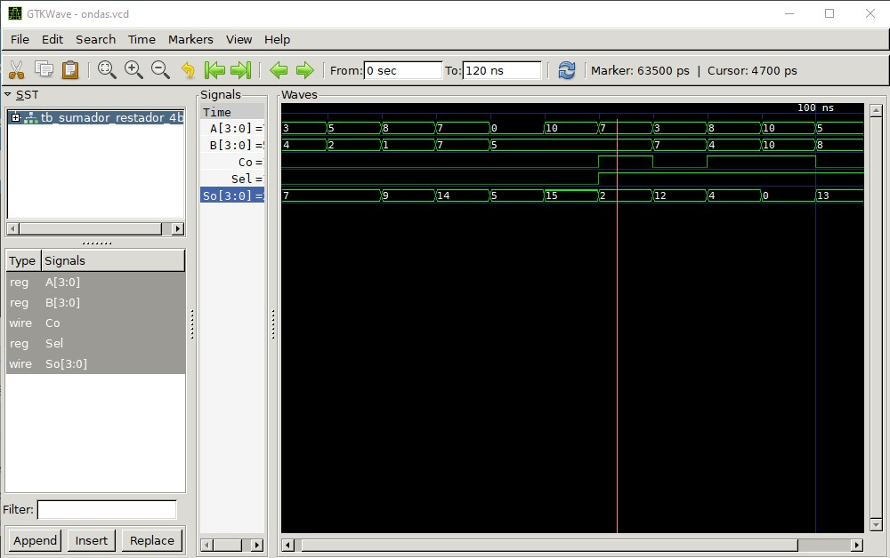

# Lab02 - Sumador/Restador de 4 bits

# Integrantes

* FERNEY REYES MONSALVE  CODIGO 2564
* WILLIAM MAURICIO SANCHEZ GAMEZ
CODIGO 105191
* JUAN DAVID BERNAL BERNAL
CODIDO 96818

Indice:
1. [Documentación](#Documentación)
2. [Simulaciones](#simulaciones)
3. [Evidencias de implementación](#evidencias-de-implementación)
4. [Preguntas](#preguntas)
5. [Conclusiones](#conclusiones)
6. [Referencias](#referencias)

# Informe Laboratorio No. 2
 ## 1. Documentacion
  ## Introduccion

  En este laboratorio abordamos la implementación de un circuito sumador/restador de 4 bits haciendo uso de la representación en complemento a 2, reutilizando el sumador de 4 bits desarrollado en el laboratorio anterior como bloque fundamental y extendiendo su funcionalidad mediante la incorporación de compuertas XOR y una señal de control Sel que determina la operación a realizar. Este enfoque nos permite demostrar una de las propiedades más importantes de la aritmética binaria: la equivalencia entre la resta y la suma del complemento a 2, lo que simplifica considerablemente el diseño del hardware al no requerir un circuito restador independiente.
  

  El principio de operación del complemento a 2 establece que la resta A−BA - B
  A−B puede transformarse en una suma equivalente de la siguiente forma:
   
  $$ A - B = A + (\sim B + 1) $$

 donde ∼B representa la inversión bit a bit de B (complemento a 1) y la adición de 1 completa la conversión al complemento a 2. Este principio es la base sobre la cual construimos la totalidad del circuito, y su implementación en hardware resulta elegante dado que no requiere lógica adicional significativa más allá de lo que ya ofrece el sumador del laboratorio previo.

 El desarrollo de esta práctica se realiza sobre la tarjeta de desarrollo DE10-Lite con el dispositivo 10M50DAF484C7G, utilizando Quartus Prime como IDE de síntesis e implementación, Verilog como lenguaje de descripción de hardware y GTKWave para la verificación mediante simulación antes de la programación física.

 ## Desarrollo de la practica 

  ## Implementacion del complemento a 2 a nivel del circuito

  En nuestro circuito, el proceso de conversión al complemento a 2 se materializa en dos acciones que el hardware ejecuta de manera simultánea al activar Sel = 1: las compuertas XOR conectadas a cada bit de la entrada B actúan como inversores controlados produciendo ∼B (complemento a 1), y ese mismo valor de Sel se conecta directamente al acarreo de entrada Cin del primer sumador de 1 bit, sumando automáticamente el +1 requerido por la definición del complemento a 2. La señal Sel cumple así un doble rol simultáneo sin necesidad de lógica adicional. Cuando Sel = 0, las compuertas XOR dejan pasar B sin modificación y Cin = 0, por lo que el circuito ejecuta la suma convencional A+B.

 Para ilustrar el funcionamiento con un ejemplo concreto, consideremos la operación 7−5: 

  * Representamos 5 en binario de 4 bits: 0101
  * Complemento a 1 (inversión bit a bit): 0101 → 1010
  * Complemento a 2 (sumamos 1): 1010 + 1 = 1011, que representa −5
  * Suma final: 0111 (7) + 10112 (−5) = 10010 
  * Descartando el acarreo de salida: 0010 = 2

  El acarreo de salida Co cumple una función de indicador de signo: cuando Co = 1 el resultado es positivo y válido en los 4 bits de salida So; cuando Co = 0 en una operación de resta, el resultado es negativo y se encuentra representado en complemento a 2 en las salidas S3, S2, S1, S0.

  ## Arquirectura modular del diseño HDL

  La descripción de hardware se implementa en Verilog siguiendo una arquitectura modular compuesta por tres niveles jerárquicos. El nivel más bajo es el full_adder_1bit, instanciado cuatro veces para conformar el full_adder_4bit del laboratorio anterior, que a su vez es reutilizado dentro del módulo principal sum_res_4bit. Esta jerarquía de diseño respeta el principio de reutilización de componentes previamente verificados y facilita la síntesis e implementación en la DE10-Lite al garantizar que el comportamiento de los bloques base ya ha sido validado.
  El módulo full_adder_1bit implementa la suma de tres bits (dos operandos y acarreo de entrada) mediante las expresiones lógicas booleanas que definen la función de suma completa:

  $$S = A \oplus B \oplus C_{in}$$

 $$C_{out} = (A \cdot B) + (C_{in} \cdot (A \oplus B))$$

 donde la salida de suma S se obtiene aplicando la operación XOR en cascada sobre los tres bits de entrada, mientras que el acarreo de salida Cout se genera cuando al menos dos de los tres bits de entrada son simultáneamente uno, condición que se captura mediante la expresión AND-OR que evalúa si hay acarreo por desbordamiento entre los operandos A y B, o bien entre el acarreo de entrada y la suma parcial A⊕B. Este módulo constituye el bloque atómico sobre el cual se construye toda la cadena de propagación de acarreo del diseño.

 El segundo nivel jerárquico corresponde al módulo full_adder_4bit desarrollado en el laboratorio anterior, que instancia cuatro veces el full_adder_1bit conectándolos en cascada de manera que el acarreo de salida Cout de cada sumador de 1 bit se conecta directamente al acarreo de entrada Cin del siguiente bit más significativo, conformando así la arquitectura de acarreo serie o ripple carry adder. La reutilización directa de este módulo en el presente laboratorio es posible porque su comportamiento fue previamente validado, lo que garantiza que cualquier error en los resultados del sumador/restador no tiene origen en la lógica de suma sino exclusivamente en la nueva lógica de control añadida.

 El nivel superior de la jerarquía es el módulo sum_res_4bit, que constituye el corazón del diseño y donde reside toda la lógica de selección de operación. Este módulo recibe como entradas los vectores de 4 bits A[3:0] y B[3:0] correspondientes a los dos operandos, y la señal escalar Sel que determina si el circuito realizará suma o resta. Internamente, el módulo declara un vector auxiliar B_xor[3:0] que almacena el resultado de aplicar la operación XOR bit a bit entre cada uno de los cuatro bits de B y la señal Sel, de modo que cuando Sel = 0 la expresión B ^ {4{Sel}} replica cuatro veces el valor cero y lo opera con cada bit de B dejando el vector sin cambios, mientras que cuando Sel = 1 replica cuatro veces el valor uno forzando la inversión de todos los bits de B y produciendo su complemento a 1. Este comportamiento es posible gracias al operador de replicación {4{Sel}} de Verilog, que expande la señal de 1 bit en un vector de 4 bits idénticos, permitiendo realizar simultáneamente las cuatro operaciones XOR en una única expresión de asignación continua.

 La conexión entre el vector B_xor y el sumador de 4 bits, combinada con la conexión directa de Sel al acarreo de entrada Cin del sumador de 1 bit menos significativo, es lo que materializa el mecanismo del complemento a 2 en hardware. El sumador de 4 bits calcula entonces la expresión A + Bxor + SelA, que cuando Sel = 1 se convierte en A + (∼B) + 1, algebraicamente equivalente a A−B. Los acarreos intermedios generados entre cada par de sumadores de 1 bit se propagan a través de señales internas de tipo wire que conectan el Cout de cada etapa con el Cin de la siguiente, garantizando que la propagación del acarreo serie se complete correctamente antes de que las salidas So[3:0] y Co tomen sus valores estables.

 ## Asignacion de perifericos en la FPGA

 Para la implementación física en la tarjeta DE10-Lite se asignan los periféricos disponibles de la siguiente manera: los switches SW[3:0] corresponden al operando A, los switches SW[7:4] al operando B, el switch SW[9] controla la señal Sel (posición baja = suma, posición alta = resta), los LEDs LEDR[3:0] muestran el resultado So, y LEDR[9] indica el estado del acarreo de salida Co. Esta distribución aprovecha los recursos de entrada/salida disponibles en la tarjeta de manera intuitiva, agrupando los operandos en la zona inferior de los switches y reservando el switch más significativo para el control de operación.

## Documentación del diseño implementado

### 1. Sumador/Restador

#### 1.1 Descripción

Descripción de la Arquitectura: Sumador/Restador de 4 bits 
El diagrama RTL ilustra un circuito aritmético combinacional diseñado para operar como un sumador y restador de 4 bits. El sistema está basado en una topología de acarreo en cascada (Ripple-Carry Adder), la cual conecta cuatro bloques sumadores completos de 1 bit (U0 a U3) de manera secuencial. En esta configuración, el acarreo de salida (Count) de cada etapa alimenta directamente la entrada de acarreo (Cin) de la etapa contigua más significativa.

La capacidad del circuito para conmutar entre operaciones de suma y resta se logra de forma eficiente mediante la señal de control Sel y un banco de compuertas lógicas XOR acopladas a las entradas del operando B. Este arreglo de hardware implementa el principio matemático del complemento a 2 lógico:

Operación de Suma (Sel = 0): Cuando la señal de control se encuentra en un nivel lógico bajo, las compuertas XOR actúan como elementos transparentes, permitiendo que los bits del bus B[3..0] ingresen a los sumadores sin modificaciones. Simultáneamente, el acarreo inicial (Cin en el bloque U0) recibe un 0 lógico. De este modo, el sistema ejecuta una suma binaria directa: $A + B$.

Operación de Resta (Sel = 1): Al establecer la señal de control en un nivel lógico alto, las compuertas XOR invierten el estado de cada bit del operando B, generando su complemento a 1. Además, la misma señal Sel introduce un 1 lógico en el acarreo inicial de U0. La suma de este bit adicional al complemento a 1 forma el complemento a 2 del operando B. En consecuencia, el circuito procesa la operación $A + (\overline{B} + 1)$, lo cual es el equivalente aritmético exacto a la resta: $A - B$.

El resultado de la operación (suma o resta) se visualiza en el bus de salida de 4 bits Sol, mientras que el pin Co proporciona el indicador de desbordamiento o acarreo final (Carry Out) generado por la última etapa del sumador (U3).

#### 1.2 Diagramas

### Figura 2. Visualización de Lógica RTL: Sumador Restador.

### Figura 3. Visualización  Sumador Restador en FPGA.

## Simulaciones 

### 1. Simulación del sumador/restador

### Figura 4. Visualización  simulación sumador-restador en GTKWAVE.

#### 1.1 Descripción

Este proyecto implementa una calculadora aritmética básica en la FPGA DE10-Lite, diseñada para sumar o restar dos números binarios de 4 bits de forma instantánea. Su arquitectura se divide en tres etapas principales:

1. Entradas (Interruptores): El sistema recibe datos a través de los switches de la tarjeta. Ocho interruptores representan los operandos A y B (4 bits cada uno). Un noveno interruptor (Sel) actúa como señal de control: un nivel bajo (0) ordena una suma, y un nivel alto (1) ordena una resta.

2. Procesamiento (Lógica de Complemento a 2): El núcleo del circuito es una cascada de cuatro sumadores completos. La operación de resta se logra mediante el método del Complemento a 2. Cuando Sel = 1, un banco de compuertas XOR invierte los bits del operando B (complemento a 1) y el mismo bit de selección inyecta un 1 en el acarreo inicial. Esto transforma matemáticamente la resta en una suma con un número negativo: A - B = A + (-B).

3. Salidas (LEDs): El resultado se visualiza en los LEDs rojos de la tarjeta. Cuatro LEDs muestran el valor numérico obtenido, mientras que un quinto LED (Co o Acarreo) tiene una función de estado: indica desbordamiento (overflow) en caso de una suma muy grande, o ayuda a determinar el signo del resultado en caso de una resta.

#### 1.2 Diagrama

## Evidencias de implementación

  

### Video 1. Implementación Sumador-Restador

  

### Video 2. Ejemplo de funcionamiento Sumador-Restador

## 4. Preguntas 

1. ¿En qué punto exacto del hardware se realiza el complemento a 1 y el complemento a 2?
 - El complemento a 1 se realiza físicamente en las cuatro compuertas XOR que reciben cada bit de la entrada B junto con la señal Sel. Cuando Sel = 1, cada compuerta XOR compara su bit de B con un
 1 lógico, y dado que la operación XOR devuelve 1 únicamente cuando sus entradas son diferentes, cualquier bit de B que era 0 se convierte en 1 y cualquier bit que era 1 se convierte en 0, produciendo exactamente la inversión bit a bit que define el complemento a 1. Este proceso ocurre de manera simultánea en los cuatro bits en el mismo instante en que la señal Sel se activa, sin necesidad de procesamiento secuencial ni ciclos de reloj adicionales ya que las compuertas XOR son lógica combinacional pura.
 El complemento a 2 se completa inmediatamente después, en la conexión entre la señal Sel y el acarreo de entrada Cin del sumador de 1 bit menos significativo, correspondiente al bit S0. Al conectar
 Sel = 1 directamente a este Cin, el sumador de la etapa cero recibe un acarreo inicial de 1 que se suma al bit B_xor[0] ya invertido, efectuando la adición del +1 que convierte el complemento a 1 en complemento a 2. Este +1 se propaga naturalmente a través de la cadena de acarreos serie hacia los bits más significativos exactamente igual que cualquier otro acarreo aritmético, de modo que el complemento a 2 completo de B emerge en forma distribuida a lo largo de la cadena de cuatro sumadores, sin que exista un punto único donde "se sume el 1" de manera aislada, sino como parte integral del proceso de suma principal A + (∼B) + 1.

 2. ¿Por qué es suficiente conectar Sel directamente al Cin del primer sumador para completar el complemento a 2, en lugar de requerir un sumador adicional?
  - Porque el complemento a 2 de B se define como (∼B) + 1. Las compuertas XOR controladas por Sel ya producen ∼B cuando Sel = 1, y la adición del +1 se realiza aprovechando el acarreo de entrada Cin del primer sumador de 1 bit. Dado que Cin = Sel = 1 en modo resta, el sumador de 4 bits calcula directamente A + (∼B) + 1, que es algebraicamente equivalente a A−B. De este modo, un único sumador de 4 bits con Cin controlado reemplaza lo que de otra manera requeriría un circuito restador independiente o un sumador adicional para el +1.

  3. ¿Qué información aporta el acarreo de salida Co en las operaciones de suma y de resta?
  - En la operación de suma (Sel = 0), Co = 1 indica desbordamiento aritmético, es decir, que el resultado de sumar A+B supera el rango representable en 4 bits (>15). En la operación de resta (Sel = 1), Co = 1 indica que el resultado es positivo o igual a cero (no hubo préstamo), mientras que Co = 0 indica que el sustraendo era mayor que el minuendo y el resultado es negativo, representado en complemento a 2 en los bits de salida S3, S2, S1, S0.

  4. ¿Qué ventaja tiene reutilizar el módulo full_adder_4bit del laboratorio anterior frente a diseñar un circuito restador desde cero?
  - Reutilizar el sumador verificado previamente reduce significativamente el tiempo de diseño y la probabilidad de introducir errores en hardware. Además, demuestra el principio fundamental de diseño modular en HDL: los bloques funcionales probados se convierten en componentes de biblioteca que pueden instanciarse en diseños más complejos sin necesidad de revalidarlos. En el contexto de sistemas digitales, esto es equivalente al uso de librerías en software, donde la confiabilidad del módulo base está garantizada por pruebas anteriores, y la nueva funcionalidad se construye exclusivamente sobre los bloques adicionales — en este caso, cuatro compuertas XOR y la conexión de Sel a Cin.

## 5. Conclusiones

La implementación del sumador/restador de 4 bits en Verilog sobre la DE10-Lite permitió verificar de manera práctica la propiedad fundamental del complemento a 2, demostrando que la resta binaria puede realizarse eficientemente reutilizando un sumador existente con la adición de compuertas XOR y una señal de control, sin necesidad de diseñar un circuito restador independiente. La señal Sel cumple un doble rol simultáneo al controlar tanto la inversión de los bits de B a través de las XOR como el acarreo de entrada Cin del primer sumador de 1 bit, completando el complemento a 2 de manera transparente en un único ciclo de operación.

La arquitectura jerárquica adoptada — instanciando cuatro veces el full_adder_1bit dentro del full_adder_4bit y este a su vez dentro del sum_res_4bit — evidencia las ventajas del diseño modular en HDL, donde los módulos previamente verificados se reutilizan como bloques de construcción confiables, reduciendo la complejidad del diseño y facilitando tanto la simulación como la síntesis. La verificación mediante simulación con vectores de prueba que cubrieron casos de suma con desbordamiento, resta con resultado positivo y resta con resultado negativo permitió validar el comportamiento del circuito antes de su programación en hardware, confirmando que la interpretación del acarreo Co como indicador de signo en modo resta y como indicador de desbordamiento en modo suma es consistente con la teoría del complemento a 2.

## 6. Referencias

* Harris, D. M., & Harris, S. L. (2012). Digital Design and Computer Architecture. Morgan Kaufmann.
* Mano, M. M., & Ciletti, M. D. (2013). Digital Design: With an Introduction to the Verilog HDL. Pearson.
* Digital ECCI. (2025). Lab02: Sumador/Restador de 4 bits - Fundamento teórico. Repositorio de    Arquitectura de Procesadores. https://github.com/digital-ECCI/Arquitectura-de-procesadores/blob/main/labs/02_lab02/README.md
* Intel Corporation. (2023). DE10-Lite User Manual. Terasic Technologies.
* Chu, P. P. (2008). FPGA Prototyping by Verilog Examples. Wiley-IEEE Press.
